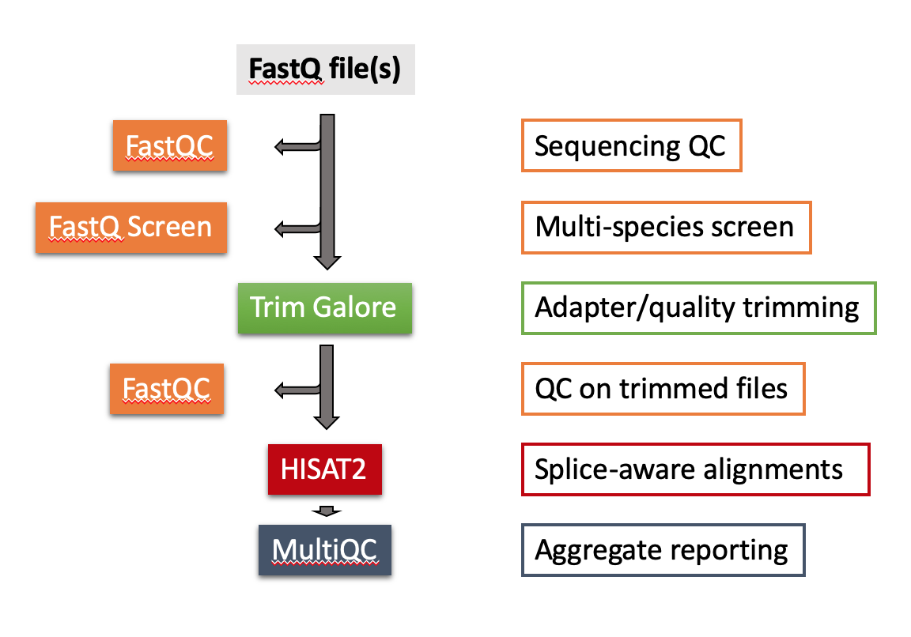

# Nextflow Pipelines at the Babraham Institute - a User Guide

#### Table of Contents
- [Multi-step pipelines](#pipelines)
- [Single program pipelines](#single-program-pipelines)
- [The Nextflow Config file](#the-nextflow-config-file)
- [Useful Nextflow knowledge](#useful-nextflow-tips)
- [RNA-seq workflow in more detail](#RNA-seq-worklow-in-more-detail)
  * [Example Workflow](#example-workflow)
  * [Example Module](#example-module)


We have recently transitioned from our previous pipelining system [Clusterflow](https://clusterflow.io/) to a new one based on [Nextflow](https://www.nextflow.io/docs/latest/index.html). We offer some preconfigured pipelines that generally discriminate between two different modes of operation: 

- single program pipelines (formerly known as modules)
- data type specific, multi-step pipelines

These pipelines are curated by the Babraham Bioinformatics Group, but you are of course welcome to write and use your own additional pipelines. If you need help getting started with Nextflow, please come and see any member of the Bioinformatics group who shall be happy to help.

## Pipelines:

Pipelines are supposed to work in a stream-lined and reproducible way every time they are run, and are designed so that users don't have to worry about specifying any of the plethora of options each tool provides. To this end, we try to run the individual programs of a pipeline with a pre-configured set of parameters that are (we find) sensible for the specified data type.

#### List of current pipelines:


- [RNA-seq workflow](#nf_rnaseq)
- [ChIP-seq/ATAC-seq workflow](#nf_chipseq)
- [QC workflow](#nf_qc)
- [Bisulfite-seq: WGBS workflow](#nf_bisulfite_WGBS)
- [Bisulfite-seq: PBAT workflow](#nf_bisulfite_PBAT)
- [Bisulfite-seq: RRBS workflow](#nf_bisulfite_RRBS)
- [Bisulfite-seq: single-cell BS-seq workflow](#nf_bisulfite_scBSseq)
- [Bisulfite-seq: single-cell NMT-seq workflow](#nf_bisulfite_scNMT)

##### nf_rnaseq

Here is an illustration of the RNA-seq workflow:



    FastQC
    FastQ Screen
    Trim Galore
    Trimmed FastQC
    HISAT2
    MultiQC
    
##### nf_chipseq
    FastQC
    FastQ Screen
    Trim Galore
    Trimmed FastQC
    Bowtie2
    MultiQC
    
##### nf_qc
    FastQC
    FastQ Screen
    MultiQC
    
##### nf_bisulfite_WGBS
    FastQC
    FastQ Screen [--bisulfite]
    Trim Galore
    Trimmed FastQC
    Bismark
    Deduplicate Bismark
    Methylation extract (coverage file) [--ignore_r2 2 for PE files]
    MultiQC
    
##### nf_bisulfite_scBSseq
    FastQC
    FastQ Screen [--bisulfite]
    Trim Galore [--clip_r1 6]
    trimmed FastQC
    Bismark [--non_directional]
    deduplicate Bismark
    Methylation extract (coverage file)
    bismark2summary
    MultiQC
    
##### nf_bisulfite_RRBS
    FastQC
    FastQ Screen [--bisulfite]
    Trim Galore [--rrbs]
    Trimmed FastQC
    Bismark
    Methylation extract (coverage file)
    bismark2summary
    MultiQC
    
##### nf_bisulfite_PBAT
    FastQC
    FastQ Screen [--bisulfite]
    Trim Galore [--clip_r1 9]
    Trimmed FastQC
    Bismark [--pbat]
    Deduplicate Bismark
    Methylation extract (coverage file)
    bismark2summary
    MultiQC

## Single Program Pipelines:

#### List of current single program pipelines:
- nf_fastqc
- nf_fastq_screen
- nf_trim_galore
- nf_trim_galore_speciality (for `--hardtrim`, `--clock`, `--polyA` etc.)
- nf_bowtie2
- nf_hisat2
- nf_bismark

In addition to the pre-configured default parameters, each pipeline accepts a single tool-specific additional argument. For the purpose of constructing this extra agrument, all software tools are `lowercase only` (e.g. `fastqc`, not `FastQC`), followed by `_args`, followed by one or more additional options you would like to supply:

```
--toolname_args "'--additional_option value --extra_flag etc.'"
```

So as an example, you could run specific trimming in Trim Galore like so:

```
--trim_galore_args "'--clip_r1 10 --clip_r2 10 --nextera'"
```

The `--toolname_args "'...'"` argument should enable experienced users to customise most tools to work in more specialised ways. It should however be stressed that it should be perfectly fine to run pre-configured pipelines such as `nf_chipseq` with no need to alter any parameters manually.


#### A note on options on Nextflow:

Options in Nextflow have to be supplied **exactly** as they are expected: non-matching options are simply ignored! This means that there is no auto-completion, and typos/omissions/case errors will result in the option not getting used at all. So please take extra care when supplying additional options. As an example:

```
--fastQC_args "'--nogroup'"
--fastq_args "'--nogroup'"
--fastqc "'--nogroup'"
```

would all result in the same behavior: nothing.


## RNA-seq worklow in more detail

Our implementation of Nextflow pipelines implements the new (and experimental) module system introduced with [DSL2](https://www.nextflow.io/docs/latest/dsl2.html). In essence, processes for different software tools and/or required processing steps are defined as separate **modules**. These modules are then invoked in separate **workflows** that define the different steps that are carried out for a given set of input files. Here is an example of the current RNA-seq workflow, which does the following consecutive steps for each FastQ file (single-end), or file  pair (paired-end):

- run FastQC or raw FastQ(s)
- run FastQ Screen species screen
- run Trim Galore to remove adapters and low quality base calls
- run FastQC again on the trimmed files
- take the trimmed FastQ files and align them to a genome using HISAT2

All output will be written to the working directory.

#### Example of an RNA-seq workflow
```nextflow
#!/usr/bin/env nextflow

// Enable modules
nextflow.preview.dsl=2

params.outdir = "."
params.genome = ""
params.verbose = false

params.fastqc_args = ''
params.fastq_screen_args = ''
params.trim_galore_args = ''
params.hisat2_args = ''

if (params.verbose){
    println ("[WORKFLOW] FASTQC ARGS: "           + params.fastqc_args)
    println ("[WORKFLOW] FASTQ SCREEN ARGS ARE: " + params.fastq_screen_args)
    println ("[WORKFLOW] TRIM GALORE ARGS: "      + params.trim_galore_args)
    println ("[WORKFLOW] HISAT2 ARGS ARE: "       + params.hisat2_args)
}

include './nf_modules/files.mod.nf'
include './nf_modules/genomes.mod.nf'
include './nf_modules/fastqc.mod.nf'                         params(fastqc_args: params.fastqc_args, verbose: params.verbose)
include  FASTQC as FASTQC2 from './nf_modules/fastqc.mod.nf' params(fastqc_args: params.fastqc_args, verbose: params.verbose)

include './nf_modules/fastq_screen.mod.nf'                   params(fastq_screen_args: params.fastq_screen_args, verbose: params.verbose)
include './nf_modules/trim_galore.mod.nf'                    params(trim_galore_args:  params.trim_galore_args, verbose: params.verbose)

include './nf_modules/hisat2.mod.nf' params(genome: getGenome(params.genome), hisat2_args:  params.hisat2_args, verbose: params.verbose)

file_ch = makeFilesChannel(args)

genome = getGenome(params.genome)


workflow {

    main:
        FASTQC(file_ch)
        FASTQ_SCREEN(file_ch)
        TRIM_GALORE(file_ch)
        FASTQC2(TRIM_GALORE.out.reads)
        HISAT2(TRIM_GALORE.out.reads)

    publish:
        FASTQC.out              to: params.outdir, mode: "link", overwrite: true
        FASTQ_SCREEN.out.html   to: params.outdir, mode: "link", overwrite: true
        FASTQ_SCREEN.out.png    to: params.outdir, mode: "link", overwrite: true
        FASTQ_SCREEN.out.report to: params.outdir, mode: "link", overwrite: true
        FASTQC2.out             to: params.outdir, mode: "link", overwrite: true
        TRIM_GALORE.out.reads   to: params.outdir, mode: "link", overwrite: true
        TRIM_GALORE.out.reports to: params.outdir, mode: 'link', overwrite: true
        HISAT2.out.bam          to: params.outdir, mode: "link", overwrite: true
        HISAT2.out.stats        to: params.outdir, mode: "link", overwrite: true

}


```


#### Example of a module (here the HISAT2 module)
```nextflow
nextflow.preview.dsl=2

params.hisat2_args = ''
params.verbose = false

// We need to replace single quotes in the arguments so that they are not getting passed in as a single string
hisat2_args = params.hisat2_args.replaceAll(/'/,"")
if (params.verbose){
	println ("[MODULE] HISAT2 ARGS: " + hisat2_args)
}

process HISAT2 {
	
	label 'bigMem'
	label 'multiCore'

    input:
	    tuple val(name), path(reads)

	output:
	    path "*bam",       emit: bam
		path "*stats.txt", emit: stats 

    script:
	cores = 8
	readString = ""
	hisat_options = hisat2_args

	// Options we add are
	hisat_options = hisat_options + " --no-unal --no-softclip "

	if (reads instanceof List) {
		readString = "-1 "+reads[0]+" -2 "+reads[1]
		hisat_options = hisat_options + " --no-mixed --no-discordant"
	}
	else {
		readString = "-U "+reads
	}
	index = params.genome["hisat2"]
	
	splices = " --known-splicesite-infile " + params.genome["hisat2_splices"]
	hisat_name = name + "_" + params.genome["name"]

	"""
	module load hisat2
	module load samtools
	hisat2 -p ${cores} ${hisat_options} -x ${index} ${splices} ${readString}  2>${hisat_name}_hisat2_stats.txt | samtools view -bS -F 4 -F 8 -F 256 -> ${hisat_name}_hisat2.bam
	"""

}
```
