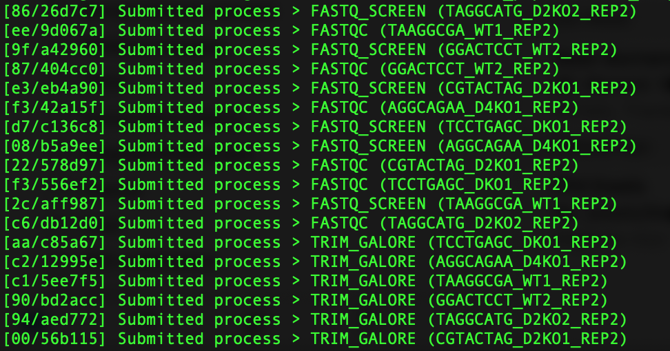
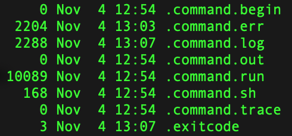
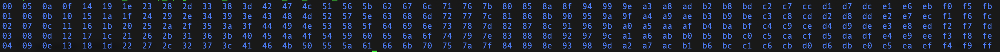
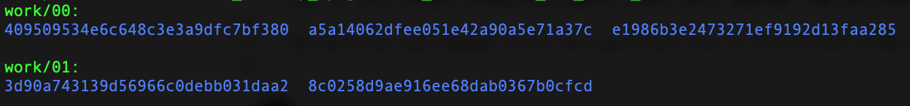
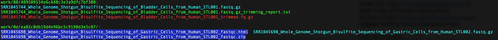
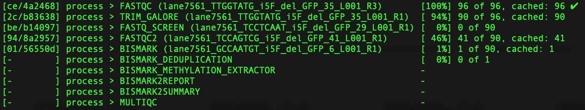

# Nextflow Pipelines at the Babraham Institute - a User Guide

#### Table of Contents
- [Multi-step pipelines](#multi-step-workflows)
- [Single program pipelines](#single-program-pipelines)
- [Specifying tool-specific parameters/arguments](#specifying-tool-specific-arguments) 
- [Nextflow Dos and Don'ts](#nextflow-dos-and-donts)
  * [Single-hyphen options are Nextflow options](#single-hyphen-options-are-nextflow-options)
    * [Logging styles (`-ansi-log`)](#logging-styles)
    * [Executing jobs in the background (`-bg`)](#executing-jobs-in-the-background)
    * [Caching (`-resume`)](#caching)
  * [Double-hyphen options are user defined options](#double-hyphen-options-are-user-defined-options)
    * [Caveat: arguments may be swallowed](#arguments-may-be-swallowed)
    * [Listing existing or adding new genomes](#adding-or-listing-existing-genomes)
  * [Useful bits and bobs](#useful-bits-and-bobs)
    - [The Nextflow Config file](#the-nextflow-config-file)
    * [The Nextflow `work` folder](#the-nextflow-work-folder)
    * [The `nextflow.config` file](#the-nextflow-config-file)
    * [Nextflow log](#nextflow-log)
    * [Dynamic retries upon error](#dynamic-retries)
    * [Executors](#executors)
    * [Hidden (but useful!) files](#hidden-files)  
- [RNA-seq workflow in more detail](#RNA-seq-worklow-in-more-detail)
  * [Example Workflow](#example-workflow)
  * [Example Module](#example-module)


We have recently transitioned from our previous pipelining system [Clusterflow](https://clusterflow.io/) to a new one based on [Nextflow](https://www.nextflow.io/docs/latest/index.html). We offer some preconfigured pipelines that generally discriminate between two different modes of operation: 

- single program pipelines (formerly known as modules)
- data type specific, multi-step pipelines

These pipelines are curated by the Babraham Bioinformatics Group, but you are of course welcome to write and use your own additional pipelines. If you need help getting started with Nextflow, please come and see any member of the Bioinformatics group who shall be happy to help.

To use any of our Nextflow pipelines, you will need to load Nextflow first:

```
module load nf
```
Now all pipelines should work, then just type `nf_` followed by hitting TAB twice to see all available workflows. 


## Multi-step workflows

Pipelines are supposed to work in a stream-lined and reproducible way every time they are run, and are designed so that users don't have to worry about specifying any of the plethora of options each tool provides. To this end, we try to run the individual programs of a pipeline with a pre-configured set of parameters that are (we find) sensible for the specified data type.

In the following section we will provide an overview of the available multi-step or single-program workflows. For more detailed help on how to run each individual workflow, please type: 

```
nf_workflowname --help
```

on the command line.

### List of current pipelines:


- [RNA-seq workflow](#nf_rnaseq)
- [ChIP-seq/ATAC-seq workflow](#nf_chipseq)
- [QC workflow](#nf_qc)
- [Bisulfite-seq: WGBS workflow](#nf_bisulfite_WGBS)
- [Bisulfite-seq: PBAT workflow](#nf_bisulfite_PBAT)
- [Bisulfite-seq: RRBS workflow](#nf_bisulfite_RRBS)
- [Bisulfite-seq: RRBS Epigenetic clock workflow](#nf_bisulfite_RRBS_clock)
- [Bisulfite-seq: single-cell BS-seq workflow](#nf_bisulfite_scBSseq)
- [Bisulfite-seq: single-cell NMT-seq workflow](#nf_bisulfite_scNMT)

#### nf_rnaseq

Here is an illustration of the RNA-seq workflow:


    FastQC
    FastQ Screen
    Trim Galore
    Trimmed FastQC
    HISAT2
    MultiQC
    
See here for a more detailed look at the [RNA-seq workflow](#example-workflow)
    
#### nf_chipseq
    FastQC
    FastQ Screen
    Trim Galore
    Trimmed FastQC
    Bowtie2
    MultiQC
    
#### nf_qc
    FastQC
    FastQ Screen
    MultiQC
    
#### nf_bisulfite_WGBS
    FastQC    
    Trim Galore
    FastQ Screen [--bisulfite]
    Trimmed FastQC
    Bismark
    Deduplicate Bismark
    Methylation extract (coverage file) [--ignore_r2 2 for PE files]
    bismark2report
    bismark2summary
    MultiQC

#### nf_bisulfite_PBAT
    FastQC
    Trim Galore [--clip_r1 9] [--clip_r2 9 for PE files]
    FastQ Screen [--bisulfite]
    Trimmed FastQC
    Bismark [--pbat]
    Deduplicate Bismark
    Methylation extract (coverage file)
    bismark2report
    bismark2summary
    MultiQC
    
#### nf_bisulfite_scBSseq

To be executed with `--single_end`

    FastQC
    Trim Galore [--clip_r1 6]
    Trimmed FastQC
    FastQ Screen [--bisulfite]
    Bismark [--non_directional]
    deduplicate Bismark
    Methylation extract (coverage file)
    bismark2report
    bismark2summary
    MultiQC
    
#### nf_bisulfite_scNMT

To be executed with `--single_end`

    FastQC
    Trim Galore [--clip_r1 6]
    Trimmed FastQC
    FastQ Screen [--bisulfite]
    Bismark [--non_directional]
    deduplicate Bismark
    Methylation extract (coverage file) [--CX]
    coverage2cytosine [--NOMe-seq]
    bismark2report
    bismark2summary
    MultiQC
    
#### nf_bisulfite_RRBS
    FastQC
    FastQ Screen [--bisulfite]
    Trim Galore [--rrbs]
    Trimmed FastQC
    Bismark
    Methylation extract (coverage file)
    bismark2report
    bismark2summary
    MultiQC
    
#### nf_bisulfite_RRBS_clock
    FastQC
    FastQ Screen [--bisulfite]
    Trim Galore [--clock]
    Trimmed FastQC1
    Trim Galore
    Trimmed FastQC2
    Bismark
    UmiBam [--dual]
    Methylation extract (coverage file)
    bismark2report
    bismark2summary
    MultiQC
    


## Single-program workflows

### List of current single program pipelines:
- FastQC
- FastQ Screen
- Trim Galore
- Bowtie2
- HISAT2
- Bismark
- UmiBam

There isn't all that much to say here, other than these pipelines can be used straight away, and they will generally do the right thing, e.g.:

```
nf_trim_galore *fastq.gz
```

will trim all files in the current directory, and send you an email once it is all complete. Simples.

Any of these single program workflows may also be used in conjunction with [tool-specific arguments/parameters](#specifying-tool-specific-arguments). Type `--help` on the command line for more detailed information on each workflow.


## Specifying tool-specific arguments 

In addition to the pre-configured default parameters, each pipeline accepts a single tool-specific additional argument. For the purpose of constructing this extra agrument, all software tools are `lowercase only` (e.g. `fastqc`, not `FastQC`), followed by `_args`, followed by one or more additional options you would like to supply. It is absolutely required that the options you want to specify are given in quotes `"your options"`, otherwise you can expect things to go wrong in some way (most likely the options you supplied will be ignored). 

**General pattern:**

```
--toolname_args="--additional_option value --extra_flag etc"
```

As an example, you could run specific trimming in Trim Galore like so:

```
--trim_galore_args="--clip_r1 10 --clip_r2 10 --nextera"
```

The `--toolname_args="..."` argument should enable experienced users to customise most tools to work in more specialised ways. It should however be stressed that our pre-configured pipelines, such as `nf_chipseq`, are designed to work 'as is' without the need to alter any parameters manually.


## Nextflow Dos and Don'ts


### Single-hyphen options are Nextflow options

There certainly are a ton of interesting or useful Nextflow options we are not (yet) aware of, but we will try to list a few of these interesting concepts here that make use of the `-` single hyphen notation. 

#### Logging styles

By default, Nextflow launches an interactive pipeline that keeps overwriting status messages in place whenever a job status updates. This looks very tidy, and it can be quite mesmerising to watch a job progress: 


Sometimes, especially during development of a new pipeline, this neat logging mode may 'swallow' some useful print or debugging statements. Thus, for testing purposes you can use the option `-ansi-log false`. This will allow log messages to be shown, and use a single line for each process:



In both modes, the Nextflow process is running interactively, and presssing `ctrl + C`, or closing the terminal window (or close the laptop) will cause the entire Nextflow pipeline process to fail and abort.

#### Executing jobs in the background 

The option `-bg` sends the entire workflow into the background, thus disconnecting it from the terminal session (similar to the `nohup` command for Linux terminal sessions). This option launches a daemon process (which will keep running on the headnode) that watches over your workflow, and submits new jobs to the SLURM queue as required. Use this option for big pipeline jobs, or whenever you do not want to watch the status progress yourself. Upon completion, the pipeline will send you an email with the job details. This option is **HIGHLY RECOMMENDED**!

Don't get [caught out](#arguments-may-be-swallowed) by specifying `--bg` (which will set a user defined variable `bg` to `true` (see more [user defined options here](#double-hyphen-options-are-user-defined-options)).

#### Executors

By default, jobs executed at Babraham will be submitted as non-interactive jobs to the stone cluster via its SLURM queueing system. Sometimes however you might want to quickly test something out on the local machine (especially when the cluster queue is packed), or port the workflow and use it elsewhere (e.g. on the cloud). For this you can specify a different executor in the `nextflow.config` file (e.g. `executor 'sge'` to change the executor to Sun Grid Engine), or on the command line via the option `-process.executor=local` to run the process on the local machine.

#### Tidying up

Once a run has completed, you will be sent an automated email informing you whether the run has been successful or not. The way our pipelines are currently setup (see [the work folder](#the-nextflow-work-folder)), all result files that are generated by the Nextflow processes are (hard-)linked from the `work/short_hash/long_hash/` folders to the current work folder. Links to the those files to do **not** take up additional disk space, and keeping the work folder enables you to make use of the [Nextflow caching mechanism](#caching).

The work folder will however still contain a copy of all files and logs involved in every single process involved, and there is good reason to want to keep the file system tidy. Once you are sure that the all processes have finished successfully you can remove the `work` folder via a command like: `rm -r work`. Please note again, that once the `work` folder has been removed, the Nextflow option `-resume` will cease to be available for the `work` directory involved.


#### Arguments may be swallowed!

This one can - and mosty likely **will** - **catch you out**! 

This comes back to the issue that Nextflow commands may take a positional argument (e.g. `--genome GRCh38`), or just act as simple switch (`--single_end`). Let's assume the working directory contains the following files:

```
sample1.fastq.gz
sample2.fastq.gz
sample3.fastq.gz
sample4.fastq.gz
```

The command:
```
nf_rnaseq --single_end --genome GRCh38 *fastq.gz
```
Would (correctly) process all four files: `sample1.fastq.gz`, `sample2.fastq.gz`, `sample3.fastq.gz` and `sample4.fastq.gz`

In contrast, a command:
```
nf_rnaseq --genome GRCh38 --single_end *fastq.gz
```
would only process files: `sample2.fastq.gz`, `sample3.fastq.gz` and `sample4.fastq.gz`

The reason for this is that `--single_end` as such will be interpreted as `true` by Nextflow if given on the command line. But it would **also** (and probably rather confusingly) take a single positional argument, which in this case is the name of the first file given as `*fastq.gz`, i.e. `--single_end sample1.fastq.gz`. This **also** evaluates to `true`, however has the undesirably side-effect of consuming the first file of `*fastq.gz` in the process. 

**TAKE HOME MESSAGE**: Any boolean switches (e.g. `--verbose`, `--single_end` etc.) **must not** preceed positional arguments. Place before other options (single or double hyphen), or at the very end (`nf_rnaseq --genome GRCh38 *fastq.gz --single_end` would also be fine).

#### Hidden files

Yes, there are hidden files, and some may be useful for debugging...



`.command.err `: contains the process output that was sent to `STDERR`

`.command.sh`: contains the exact commands that were executed, e.g.:

```
#!/bin/bash -ue
module load trim_galore
module load fastqc
trim_galore   SRR1045678_Whole_Genome_Shotgun_Bisulfite_Sequencing_of_Aorta_Cells_from_Human_STL002.fastq.gz
```

`.command.run`: This is the Nextflow task file. Probably for more specialised people...

```
#!/bin/bash
#SBATCH -D ../work/00/a5a14062dfee051e42a90a5e71a37c
#SBATCH -J nf-TRIM_GALORE_(SRR1045678_Whole_Genome_Shotgun_Bisulfite_Sequencing_of_Aorta_Cells_from_Human_STL002)
#SBATCH -o ../work/00/a5a14062dfee051e42a90a5e71a37c/.command.log
#SBATCH --no-requeue
#SBATCH -c 4
#SBATCH --mem 10240M
# NEXTFLOW TASK: TRIM_GALORE (SRR1045678_Whole_Genome_Shotgun_Bisulfite_Sequencing_of_Aorta_Cells_from_Human_STL002)
set -e
set -u
NXF_DEBUG=${NXF_DEBUG:=0}; [[ $NXF_DEBUG > 1 ]] && set -x
NXF_ENTRY=${1:-nxf_main}

nxf_tree() {
    local pid=$1
...
```

`.exitcode`: Well, duh...

#### The Nextflow config file


#### The Nextflow `work` folder

It is not recommended to keep the work folder to run different pipelines in the same folder!

Work folder level 1:



Work folder level 2:



Work folder level 3:



#### Dynamic retries

Nextflow offers different strategies to [deal with errors](https://www.nextflow.io/docs/latest/process.html#errorstrategy). For some of our processes we use dynamic retries (e.g. up to 5 retries), where we increase the amount of memory that the Slurm job is asking for each time (see [dynamic computing resources](https://www.nextflow.io/docs/latest/process.html#dynamic-computing-resources)). If you have any questions about this, please come and see someone in the Bioinformatics team.

#### Nextflow log

Sometimes it is very informative to run the command `nextflow log` in a directory where you tried to execute one or more jobs. This brings up previously executed jobs in this folder, along with useful stats (e.g. whether the job suceeded or errored).

The nextflow log command lists the executions run in the current folder, here is an example:
```
TIMESTAMP          	DURATION  	RUN NAME         	STATUS	REVISION ID	SESSION ID                          	COMMAND  
2020-10-08 12:33:38	53m       	lonely_bhabha  	ERR   	8a59348cdc 	021addb3-61dc-47e2-b795-64a6a30945b3	nextflow nf_chipseq --genome GRCh38 *.fastq.gz        
2020-10-08 13:54:04	1h 11m 25s	maniac_laplace 	OK    	8a59348cdc 	021addb3-61dc-47e2-b795-64a6a30945b3	nextflow nf_chipseq --genome GRCh38 *.fastq.gz -resume
```

If you want to dig in deeper yourself, you can look at the hidden file `.nextflow.log` yourself (probably for debugging only).

#### Caching 

If a pipeline workflow has been interrupted or stopped (e.g. by accidentally closing a laptop), this option will attempt to resume the workflow at the point it got interrupted by using Nextflow's caching mechanism. This may save a lot of time.
				  


To learn more about continuing a halted workflow execution please see this blog post: [Demyistifying Nextflow resume](https://www.nextflow.io/blog/2019/demystifying-nextflow-resume.html)
				  

**Don't get [caught out](#arguments-may-be-swallowed)** by specifying `--resume` (which will set a user defined variable `resume` to `true` (see more [here](#double-hyphen-options-are-user-defined-options)).


## Double-hyphen options are user defined options

As a rule, anything with two hyphens (`--`) is a user defined option. 

Options in Nextflow have to be supplied **exactly** as they are expected: non-matching options are simply ignored! This means that there is no auto-completion, and typos/omissions/case errors will result in the option not getting used at all. So please take extra care when supplying additional options. As an example:

```
--fastQC_args="--nogroup"
--fastq_args="--nogroup"
--fastqc="--nogroup"
```

would all result in the same behavior: precisely nothing.

Internally, it works like this: 

Any option given on the command line, say `--help`, would internally be stored in a variable called `params.help` (and in this case set this variable to `true` and display the help text for a pipeline). One might define this variable within the Nextflow script to give the variable a default value, e.g.:

```
params.help = false
```

so that one can work with the variable irrespective of whether it has been specified on the command line. The variable `params.help` would also be set to `true` if no default value was defined within the Nextflow script. 

If one were to specify the option accidentally as `--hell`, this would set an internal variable called `params.hell` to `true`. However, since it is unlikely that the script will make use of a variable called `params.hell`, in effect it will be simply ignored. This might catch you out when specifying `--bg` or `--resume` (**don't do that!**).

#### Adding or listing existing genomes

We have already added a considerable number of usable genomes to a folder called `genomes.d` in the Nextflow installation folder. To see all genomes that are already available, type any pipeline that accepts a genome (e.g. `nf_rnaseq`) followed by `--list_genomes`. This will return a list of all usable genome (by convention we are trying to use the genome build as the name to be used in our pipelines.


For more detailed information on all files and indexes that are included for each of the genomes, type `--list_genomes --verbose`.

## RNA-seq worklow in more detail

Our implementation of Nextflow pipelines implements the new (and experimental) module system introduced with [DSL2](https://www.nextflow.io/docs/latest/dsl2.html). In essence, processes for different software tools and/or required processing steps are defined as separate **modules**. These modules are then invoked in separate **workflows** that define the different steps that are carried out for a given set of input files. Here is an example of the current RNA-seq workflow, which does the following consecutive steps for each FastQ file (single-end), or file  pair (paired-end):

- run FastQC on raw FastQ(s)
- run FastQ Screen species/contamination screen
- run Trim Galore to remove adapters and low quality base calls
- run FastQC again, this time on the adapter-/quality trimmed files
- take the trimmed FastQ files and align them to a genome using HISAT2
- once everything is complete - run MultiQC on all files for all samples

All output will be written to the working directory.

#### Example workflow

Here is an example of the current RNA-seq workflow (the `--help` text is omitted):

```nextflow
#!/usr/bin/env nextflow
nextflow.preview.dsl=2

// last modified 13 October 2020

params.outdir = "."
params.genome = ""
params.verbose = false
params.single_end = false  // default mode is auto-detect. NOTE: params are handed over automatically  

params.fastqc_args = ''
params.fastq_screen_args = ''
params.trim_galore_args = ''
params.hisat2_args = ''
params.multiqc_args = ''

params.help = false
// Show help message and exit
if (params.help){
    helpMessage()
    exit 0
}

params.list_genomes = false;
if (params.list_genomes){
    println ("[WORKLFOW] List genomes selected")
}

if (params.verbose){
    println ("[WORKFLOW] FASTQC ARGS: "           + params.fastqc_args)
    println ("[WORKFLOW] FASTQ SCREEN ARGS ARE: " + params.fastq_screen_args)
    println ("[WORKFLOW] TRIM GALORE ARGS: "      + params.trim_galore_args)
    println ("[WORKFLOW] HISAT2 ARGS ARE: "       + params.hisat2_args)
    println ("[WORKFLOW] MULTIQC ARGS: "          + params.multiqc_args)
}

include { makeFilesChannel; getFileBaseNames } from './nf_modules/files.mod.nf'
include { getGenome }    from './nf_modules/genomes.mod.nf'
include { listGenomes }  from './nf_modules/genomes.mod.nf'

if (params.list_genomes){
    listGenomes()  // this lists all available genomes, and exits
}
genome = getGenome(params.genome)

include { FASTQC }       from './nf_modules/fastqc.mod.nf'
include { FASTQC as FASTQC2 } from './nf_modules/fastqc.mod.nf'
include { FASTQ_SCREEN } from './nf_modules/fastq_screen.mod.nf'
include { TRIM_GALORE }  from'./nf_modules/trim_galore.mod.nf'
include { HISAT2 }       from './nf_modules/hisat2.mod.nf' params(genome: genome)

include { MULTIQC }      from './nf_modules/multiqc.mod.nf' 
file_ch = makeFilesChannel(args)

workflow {

    main:
        FASTQC         (file_ch, params.outdir, params.fastqc_args, params.verbose)
        FASTQ_SCREEN   (file_ch, params.outdir, params.fastq_screen_args, params.verbose)
        TRIM_GALORE    (file_ch, params.outdir, params.trim_galore_args, params.verbose)
        FASTQC2        (TRIM_GALORE.out.reads, params.outdir, params.fastqc_args, params.verbose)
        HISAT2         (TRIM_GALORE.out.reads, params.outdir, params.hisat2_args, params.verbose)

        // merging channels for MultiQC
        multiqc_ch = FASTQC.out.report.mix(
            TRIM_GALORE.out.report,
            FASTQ_SCREEN.out.report.ifEmpty([]),
            FASTQC2.out.report.ifEmpty([]),
            HISAT2.out.stats.ifEmpty([]),
        ).collect()

        // multiqc_ch.subscribe {  println "Got: $it"  }

        MULTIQC                          (multiqc_ch, params.outdir, params.multiqc_args, params.verbose)
}

```


#### Example module

Here is an example of the current HISAT2 module:

```nextflow
nextflow.enable.dsl=2

process HISAT2 {
	
    tag "$name" // Adds name to job submission instead of (1), (2) etc.

    label 'bigMem'
    label 'multiCore'

    input:
        tuple val(name), path(reads)
	val (outputdir)
	val (hisat2_args)
	val (verbose)

    output:
	path "*bam",       emit: bam
	path "*stats.txt", emit: stats 

	publishDir "$outputdir",
	mode: "link", overwrite: true

    script:
	
	if (verbose){
	    println ("[MODULE] HISAT2 ARGS: " + hisat2_args)
	}
	
	cores = 8
	readString = ""
	hisat_options = hisat2_args

	// Options we add are
	hisat_options = hisat_options + " --no-unal --no-softclip "

	if (reads instanceof List) {
	    readString = "-1 "+reads[0]+" -2 "+reads[1]
	    hisat_options = hisat_options + " --no-mixed --no-discordant"
	}
	else {
	    readString = "-U "+reads
	}
	index = params.genome["hisat2"]

	splices = " --known-splicesite-infile " + params.genome["hisat2_splices"]
	hisat_name = name + "_" + params.genome["name"]

	"""
	module load hisat2
	module load samtools
	hisat2 -p ${cores} ${hisat_options} -x ${index} ${splices} ${readString}  2>${hisat_name}_hisat2_stats.txt | samtools view -bS -F 4 -F 8 -F 256 -> 		${hisat_name}_hisat2.bam
	"""

}
```


## Credits
This documentation was written by Felix Krueger and Simon Andrews, part of the [Babraham Bioinformatics](https://www.bioinformatics.babraham.ac.uk) group.
<p align="center"> </p>
